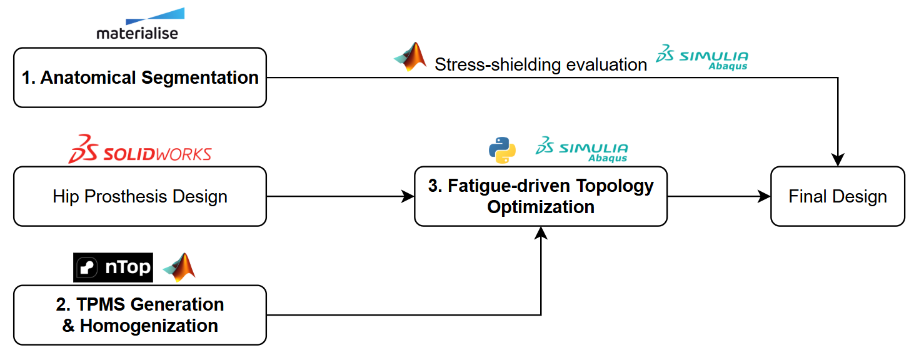

# 🚀 Topology Optimization of Functionally Graded Lattice Femoral Stem: Balancing Stress-shielding Reduction and Fatigue Resistance

## 📌 Project Overview
This thesis project details the development of a comprehensive computational pipeline bridging biomechanics, computational micromechanics, and advanced structural optimization. The core objective is to design highly optimized, ISO 7206-4 fatigue-resistant orthopedic hip implants utilizing Additive Manufacturing capabilities, specifically Triply Periodic Minimal Surfaces (TPMS).

## 🛠️ Technology Stack
* **Core Languages:** Python 2.7 (Optimization loop), Matlab (Homogenization and post-processing)
* **FEM Analysis:** Abaqus/CAE
* **Medical Image Processing:** Materialise Mimics and Materialise 3-Matic
* **3D Design:** Solidworks, nTop

---

## ⚙️ System Architecture: The Multi-Scale Pipeline
The workflow is divided into three major computational phases, seamlessly handling both macro-scale anatomy and micro-scale lattice structures.

> **Figure 1:** High-level overview of the multi-scale methodology, from medical imaging to the final optimized topology.

### Phase 1: Anatomical Segmentation (Macro-Scale)
* **Software:** Medical Imaging Tools (Materialise Mimics, Materialise 3-Matic)
* Extraction of the 3D anatomical domain (human femur) from Medical CT scans. Surface smoothing, boolean operations, and generation of the finite element mesh suitable for macro-scale load cases.

### Phase 2: TPMS Generation & Homogenization (Micro-Scale)
* **Software:** Python & Abaqus
* Generation of Triply Periodic Minimal Surfaces (TPMS) lattice unit cells. **Computational Homogenization** via nTop to extract the effective, equivalent stiffness matrix and via Matlab to obtain the fatigue limits of the complex micro-architectures.

### Phase 3: Fatigue-Driven Topology Optimization (Macro-Scale)
* **Software:** Python (Optimization Engine) & Abaqus (FEM Solver)
* **Objective:** Minimize compliance (maximize stiffness) over the anatomical domain.
* **Constraints:** Volume fraction and local fatigue stress limit to ensure resistance to ISO 7206-4 loading conditions.

---

## 🧠 Technical Challenges & Integration Details
The primary contribution of this thesis was adapting and extending a baseline academic TopOpt framework to handle complex, real-world multi-scale problems. Key integrations and engineering solutions include:

* **Density-Dependent Fatigue Limit via Static Analysis**
  * *Challenge:* Running full cyclic fatigue simulations inside an iterative loop is computationally prohibitive. Furthermore, for TPMS lattices, the fatigue limit is not a constant material property but heavily depends on the local relative density (ρ).
  * *Solution:* Evaluated fatigue resistance using static finite element analysis by mapping a dynamic, density-dependent fatigue limit as the strict target constraint. As the optimizer updates the local element density, the allowable stress threshold dynamically adjusts (σ_allowable = f(ρ)). This ensures the structure respects the specific high-cycle fatigue limits of the porous TPMS architecture without the massive computational overhead of transient analysis.

* **Multi-Scale Material Integration (TPMS)**
  * *Challenge:* The baseline framework was designed for standard, fully solid isotropic materials.
  * *Solution:* Modified the framework to accept and utilize the homogenized equivalent stiffness matrices derived from the micro-scale TPMS lattice structures, allowing the macro-scale optimization to "see" the mechanical behavior of the 3D-printed infill.

--

## 📚 Acknowledgments & References
* **Baseline TopOpt Framework:** The fundamental structure for coupling Python with Abaqus for stress-constrained topology optimization was adapted from the open-source repository [Python-Code-for-Stress-Constrained-Topology-Optimization-in-ABAQUS](https://github.com/pnfernandes/Python-Code-for-Stress-Constrained-Topology-Optimization-in-ABAQUS) by P. N. Fernandes.
* **MMA Algorithm:** The core mathematical optimization relies on the Method of Moving Asymptotes, originally developed by Krister Svanberg (1987).
* **Novel Contributions:** The baseline framework was heavily extended in this thesis to support multi-scale integration (TPMS lattices), and variable density-dependent fatigue constraints.

